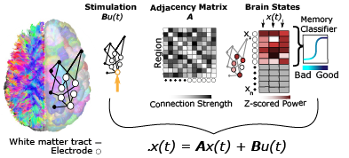

# NetworkControl
This repository contains basic functions in MATLAB to enable to application of network control theory to complex systems. 

Specifically, it contains 4 functions:
(1) open_loop_control:                        This function simulates classic open loop control x_dot(t) = Ax(t) + Bu(t)

(2) optim_fun                                 This function estimates optimal energy required to drive the system from a given initial to a given final state. Optimality is determined via constraints on distance and energy

(3) modal_controlability_continuous           This calculates persistant and transient controllability for continuous systems.

(4) determinant_ratio                         This calculates the determinant ratio for a given network. This code returns a single measure for the network, thoughthe metric can be adapted as a regional measure

(5) get_traj                                  This takes the output from open_loop_control and calculates similarity measures to a target state (correlation and Frobenius norm distance)

## White Matter Network Architecture Guides Direct Electrical Stimulation through Optimal State Transitions
These are key functions needed to produce results for the above paper in Cell Reports ([https://www.sciencedirect.com/science/article/pii/S2211124719310411](from journal), or [http://www.jenniferstiso.com/publications/](from website)

## Contributors (Alphabetically)
* Jennifer Stiso
* Tommaso Menara
